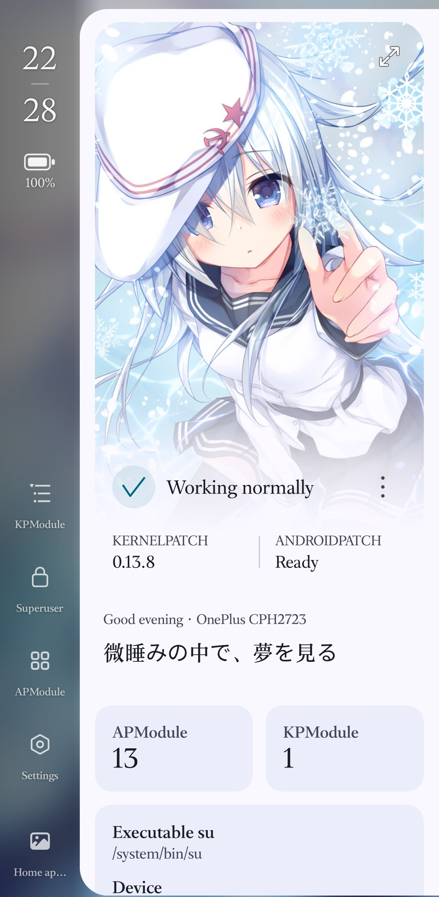
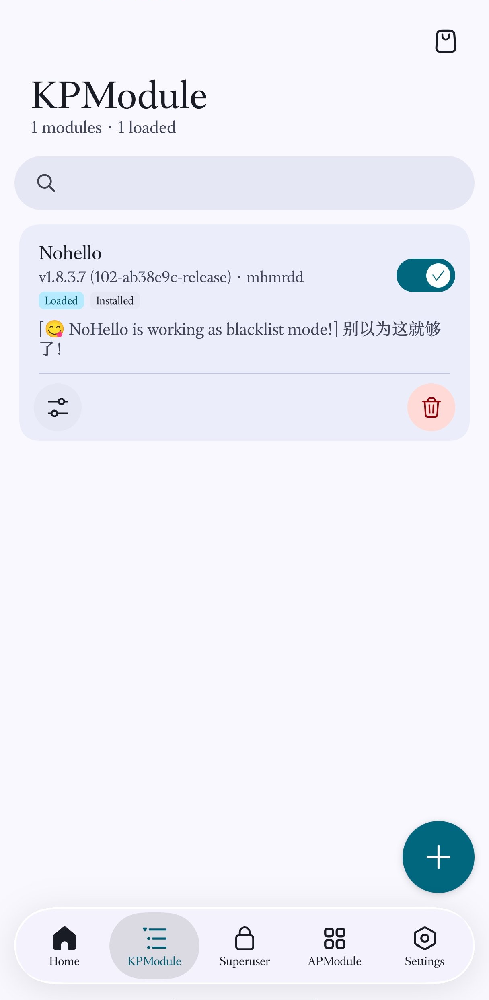
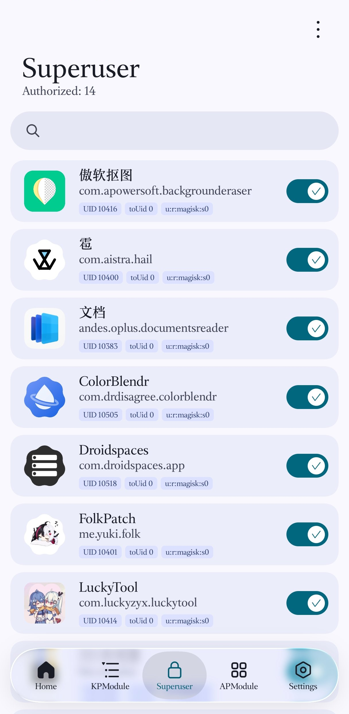
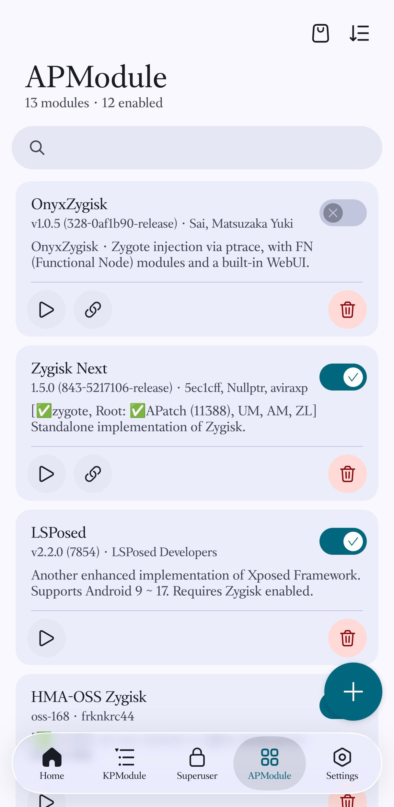
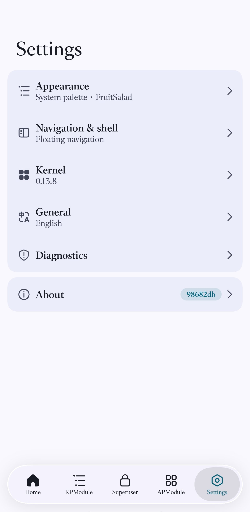
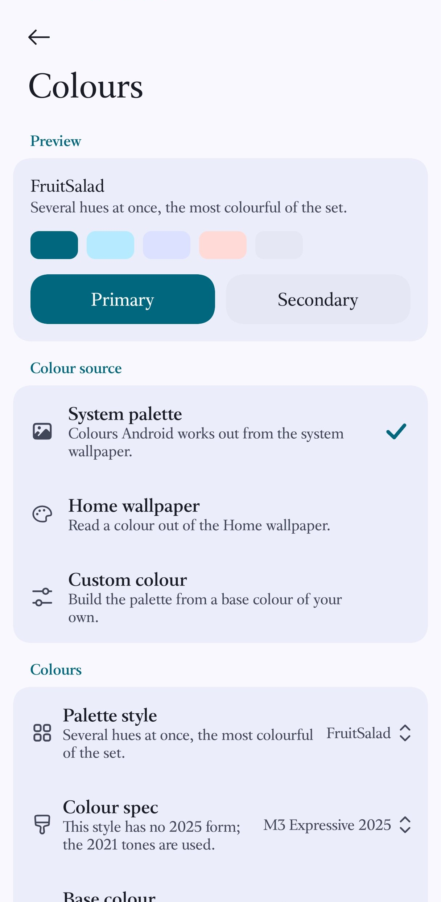

🌏 **README の言語:** [**English**](./README_EN.md) / [**中文**](./README.md) / [**日本語**](./README_JA.md)

Aster - APatch のケイパビリティチェーンに向けた Miuix 単一 UI の Root コントロールサーフェス

Aster は [KernelPatch](https://github.com/bmax121/KernelPatch) を基盤に、Root の状態、カーネルモジュール（KPM）、システムモジュール（APM）、スーパーユーザー管理をひとつながりの Miuix インターフェースにまとめます。ホームは「いま Root が信頼できるか」に最初に答えることを優先し、システム性能のダッシュボードにはしません。

[📚 ドキュメントを読む](https://aster.mysqil.com/) →

<!-- TODO: スクリーンショット表。docs/screenshots/1.png … 6.png に 6 枚。まだ存在しません。
<table>
  <tr>
    <td></td>
    <td></td>
    <td></td>
  <tr>
  <tr>
    <td></td>
    <td></td>
    <td></td>
  <tr>
</table>
-->

---

## ✨ はじめに

### 🎨 コア機能

- [x] KernelPatch による Root 実装
- [x] カーネルを再コンパイルせずにカーネル関数をフック

### 📱 動作要件

- **必須：** ARM64 アーキテクチャの Android デバイス
- Android カーネル 3.18 - 6.18
- カーネル設定 `CONFIG_KALLSYMS=y`（`CONFIG_KALLSYMS_ALL=y` も推奨）

### 🖥️ インターフェース

- [x] Miuix 単一 UI シェル：スマートフォンでは 5 つの入口が常設の左レールに並び、第一階層のナビゲーションはフローティング下部バーにも Pager にも依存しません
- [x] 第一階層の入口は Root の状態によって消えません。利用できないときは淡色表示にし、理由と復帰手段を示します
- [x] レール下部が実行モードを直接表します：`Full APatch` / `KernelPatch-only` / `Jailbreak` / `Unavailable`
- [x] パノラマホーム：壁紙は環境レイヤーにすぎず、既定では無効。有効にしても状態と危険な操作の可読性を損ないません
- [x] アプリの配色は壁紙、システムの Material You、プリセットから選べます
- [x] カスタムフォントとアプリ表示サイズ
- [x] デスクトップアイコンは Aster と APatch の 2 つのマークを切り替えられ、アプリの配色に追従させるかどうかも選べます

### 📦 モジュール

- [x] **APM**：Magisk に似たモジュールシステム。一括導入と完全バックアップに対応
- [x] **KPM**：カーネルモジュール（`inline-hook` と `syscall-table-hook`）。自動読み込みに対応
- [x] モジュールリポジトリ：人気の APM / KPM を閲覧してワンタップ導入
- [x] モジュールの WebUI 対応
- [x] Magic mount

### 🛡️ 保護された実行時操作

システムプロパティを変更する操作は直接には適用されず、ロールバック可能なセッションの中で実行されます：

- 事前チェックで**実際のプロパティ変化**、またはソースファイルと対象ファイルの差分を先に表示します
- 保持する前に必ず **60 秒の試行**を行います
- 適用の失敗、試行の期限切れ、セーフモードの検出時には**自動で復元を試みます**
- 保持は**現在の boot ID** に対してのみ有効で、再起動後は再び無効になります
- 復元に失敗した場合はエラーを明示し、復元記録を残します。復元済みと偽ることはありません

状態の隠蔽は、実際に変更が必要な 4 つの `ro.boot.*` プロパティのみを扱います。Bootloader を実際に再ロックすることはなく、ADB、デバッグ、ログ、`persist.*` の設定も変更せず、ハードウェア認証の回避も約束しません。詳細は[保護された実行時操作](docs/cn/runtime-safety.md)（中国語）を参照してください。

### ⚡ 技術的な特徴

- [x] [KernelPatch](https://github.com/bmax121/KernelPatch) を基盤としています
- [x] アプリ UI と APModule のソースコードは [KernelSU](https://github.com/tiann/KernelSU) から派生・改変しています

## 🔐 セキュリティに関する注意

**SuperKey は root よりも強い権限を持ちます。** 弱い鍵や漏洩した鍵は、デバイスが不正に操作される原因になります。強固な鍵を使い、外部に漏れないよう厳重に管理してください。

## 🌏 翻訳

翻訳は LLM が管理しています。中国語と英語が参照言語であり、この 2 言語に対する PR 修正は受け付けません。新しい言語の追加や既存の翻訳の改善を希望する場合は、その言語のみを対象とした PR を送ってください。

## 🚀 ダウンロードとインストール

1. **ダウンロード：**
   [リリースページ](https://github.com/LyraVoid/Aster/releases/latest)から最新のパッケージを取得します

2. **インストール：**
   パッケージを Android デバイスにインストールし、アプリ内の案内に従って導入します

3. **使いはじめる：**
   [ドキュメント](https://aster.mysqil.com/)を読むか、[リポジトリ内のドキュメント](docs/)を参照してください

## 🙏 謝辞

本プロジェクトは以下のオープンソースプロジェクトを基盤としています：

- [KernelPatch](https://github.com/bmax121/KernelPatch) - コア
- [Magisk](https://github.com/topjohnwu/Magisk) - magiskpolicy
- [KernelSU](https://github.com/tiann/KernelSU) - アプリ UI と Magisk に似たモジュール対応
- [APatch](https://github.com/bmax121/APatch) - 上流ブランチ
- [Miuix](https://github.com/miuix-kotlin-multiplatform/miuix) - インターフェースコンポーネントライブラリ

## 📄 ライセンス

- Aster は [GNU General Public License v3 (GPL-3)](http://www.gnu.org/copyleft/gpl.html) の下で公開されています。改変者または配布者は以下の基準を守る必要があります：
- コードを改変した場合、または Aster をプロジェクトに組み込んで第三者に配布する場合、そのプロジェクト全体を同じ GPLv3 で公開する必要があります
- バイナリを配布する際は、完全で読める形のソースコードを提供するか、提供を約束する必要があります
- ソフトウェアのライセンス自体に対して許諾料を請求することはできません。配布、技術支援、受託開発に対しては請求できます
- 配布行為は、本プロジェクトに関わるあなたの特許をすべての利用者に許諾したことを意味します
- 本ソフトウェアは「現状のまま」提供され、いかなる保証も伴いません。作者は本ソフトウェアの使用によって生じたいかなる損害についても責任を負いません
- 上記のいずれかに違反した場合、あなたの GPLv3 許諾は自動的に終了し、Aster を配布する権利を失います

## 💬 コミュニティ

- Telegram チャンネル：[**@FolkPatch**](https://t.me/FolkPatch)
